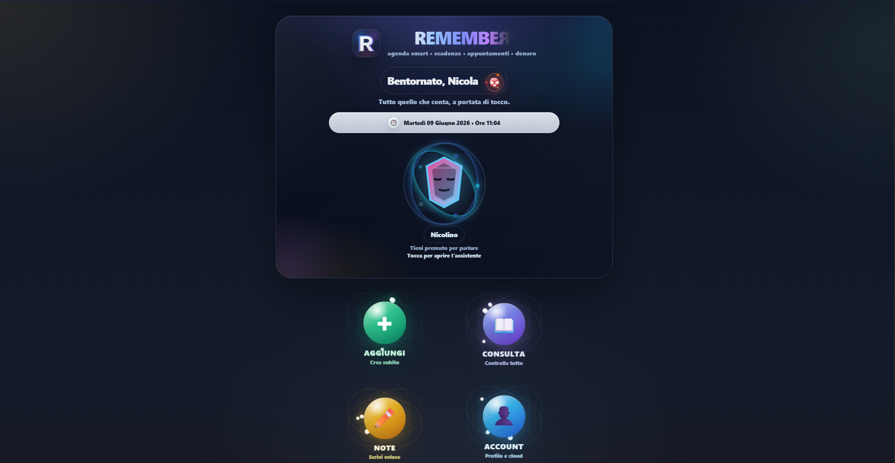
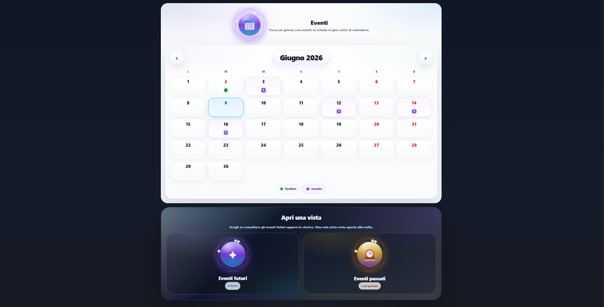
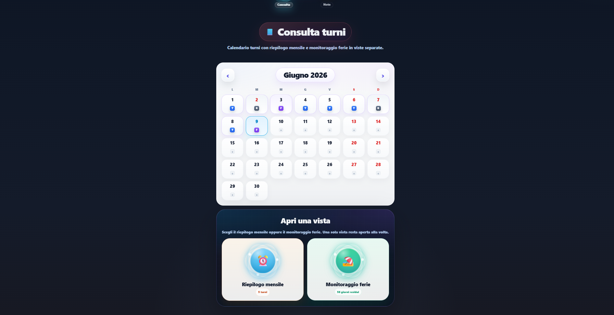

# Nicola Rigoni – Junior Web Developer Portfolio

Hi, I'm Nicola Rigoni, a Junior Web Developer and Computer Engineering student based in Italy.

I build modern websites, web apps and practical business tools using technologies such as React, TypeScript, JavaScript, Python and Supabase.

This portfolio presents some of my personal and internal projects. Some repositories are private because they contain production code, business logic, API keys or sensitive configuration files.

---

## Projects

### 1. Remember – Productivity Web App

Remember is a productivity web app designed to help users organize reminders, notes, appointments, deadlines and personal planning.

The project includes a modern interface, structured sections, calendar-based organization, account features and cloud-based data management.

**Main features:**

* Reminders and deadlines management
* Notes organization
* Appointments and planning sections
* Responsive interface
* Account and cloud-based features
* Modern productivity dashboard

**Technologies used:**

* React
* TypeScript
* JavaScript
* Supabase
* HTML
* CSS
* Vite
* GitHub
* Vercel

**Status:** In development / private repository

---

### 2. Business Management System – Python Internal Tool

This project is an internal business management system created to organize operational data, documents, schedules and workflows.

It was designed to improve daily work organization and simplify the management of repeated tasks and structured information.

**Main features:**

* Internal dashboard
* Data organization
* Document management
* Scheduling and planning logic
* Multi-section interface
* Workflow support for business operations

**Technologies used:**

* Python
* FastAPI
* HTML
* CSS
* JavaScript
* Local data management
* Browser-based interface

**Status:** Private project / internal use

---

### 3. Website Project

A responsive website project created to practice and apply modern front-end development principles.

The project focuses on clean layout, responsive design and user-friendly structure.

**Main features:**

* Responsive layout
* Modern website structure
* Clean visual design
* Front-end implementation
* Mobile-friendly interface

**Technologies used:**

* HTML
* CSS
* JavaScript
* Responsive Design

**Status:** Portfolio project

**Screenshots:**

### Home dashboard

### Events calendar

### Shifts and monthly overview

---

## Skills

* Front-end development
* Responsive web design
* Web app development
* React and TypeScript basics/intermediate practice
* JavaScript development
* Python business tools
* Supabase database integration
* Git and GitHub project management
* Practical problem solving for small businesses and teams

---

## Contact

- Email: nicolarigoni1993@gmail.com
- LinkedIn: https://www.linkedin.com/in/nicola-rigoni-b9443a367
- GitHub: https://github.com/nicolarigoni1993-cloud
