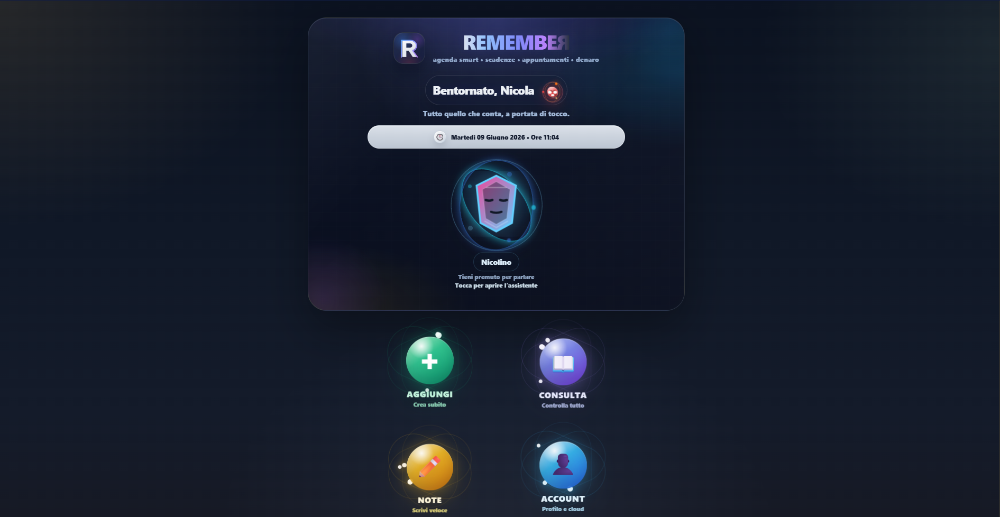
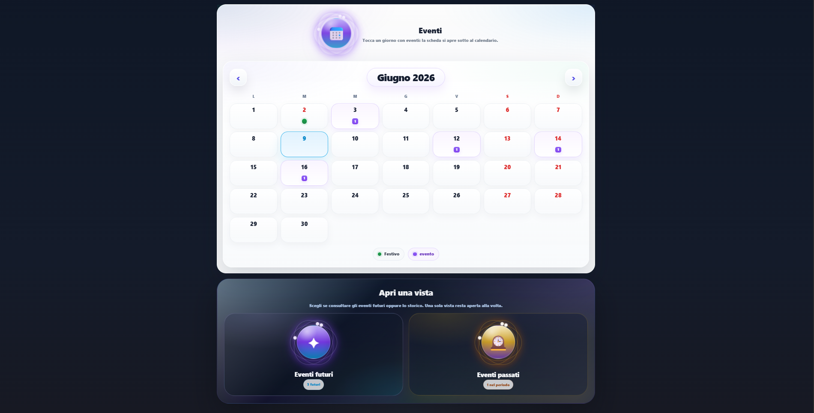
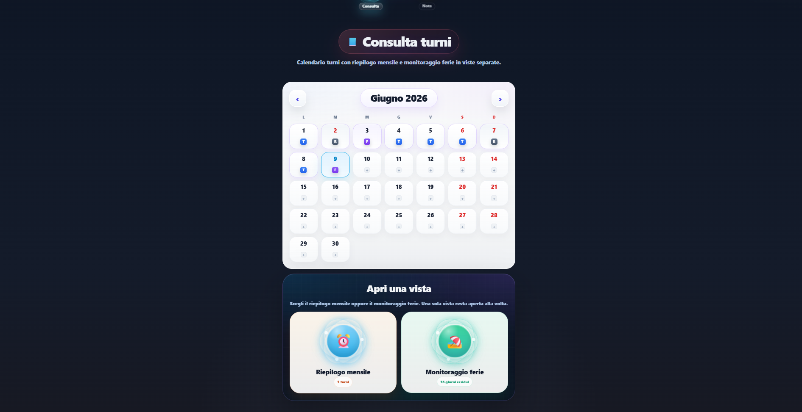

# Nicola Rigoni – Web Developer Portfolio

I'm Nicola Rigoni, a Web Developer and Computer Engineering student based in Italy.

I build, improve and debug websites, web applications and practical business tools using React, TypeScript, JavaScript, Supabase, PostgreSQL, Python and FastAPI.

This portfolio presents selected personal and internal projects. Some repositories are private because they contain production code, business logic or sensitive configuration.

---

## Current focus

I am currently focused on **100% remote freelance and contract work** involving:

- Bug fixing and maintenance on existing web applications
- React / TypeScript feature development
- Python / FastAPI backend work
- REST API and JSON integrations
- Supabase / PostgreSQL data flows
- Authentication and authorization debugging
- Responsive and mobile usability improvements
- Manual QA and regression testing
- Security-minded web application review, including OWASP-oriented checks, access-control issues and Supabase RLS review
- Practical internal tools and business workflows

---

## Projects

### 1. Remember – Productivity Web App

Remember is a productivity web application designed to help users organize reminders, notes, appointments, deadlines and personal planning.

The project includes a modern responsive interface, structured sections, calendar-based organization, account features and cloud-backed data management.

**Main features:**

- Reminders and deadlines management
- Notes organization
- Appointments and planning sections
- Shift management
- Finance tracking
- Responsive interface
- Account and user-specific data flows
- Cloud-backed persistence

**Technologies used:**

- React
- TypeScript
- JavaScript
- Supabase
- PostgreSQL-backed data
- HTML
- CSS
- Vite
- GitHub

**Status:** In development / private repository

**Screenshots:**

#### Home dashboard

#### Events calendar

#### Shifts and monthly overview

---

### 2. Business Management System – Python / FastAPI

This project is an internal business management application developed to organize operational data, work areas, documents, schedules, staff availability and recurring workflows.

The goal is to replace scattered manual processes with a structured browser-based tool, making information easier to access, update and monitor during daily operations.

The full project is private because it contains internal workflows, business logic and operational data. The screenshots shown here are limited to safe sections of the interface.

**Main features:**

- Multi-section internal dashboard
- Operational data management
- Daily planning and scheduling tools
- Staff availability and shift monitoring
- Training and qualification tracking
- Calendar-based workflows
- Document and information organization
- Internal forms and structured data entry
- Browser-based interface usable from multiple PCs
- Workflow support for repeated business operations

**Technologies used:**

- Python
- FastAPI
- HTML
- CSS
- JavaScript
- JSON / structured local data
- REST-style application flows
- Git
- GitHub

**Status:** Private project / internal use

**Screenshots:**

#### Training and qualification monitoring

#### Daily shift planning calendar

---

### 3. I Rapaci di Eddy – Responsive Website

A responsive multi-page website developed for a real-world showcase use case, with a focus on clear navigation, visual presentation and mobile usability.

**Main features:**

- Responsive layout
- Multi-page website structure
- Mobile-friendly navigation
- Image galleries and content sections
- Front-end implementation
- Production deployment

**Technologies used:**

- HTML
- CSS
- JavaScript
- Responsive Design

**Live website:**

https://irapacidieddy.com/

**Screenshots:**

#### Website home page

#### Breeding / content section

#### Video section

---

## How I work on existing code

I prefer focused, testable changes over unnecessary rewrites.

Typical workflow:

1. Reproduce the issue
2. Inspect the affected code, API and data flow
3. Identify the root cause
4. Implement the smallest reliable fix or feature
5. Test the affected path and likely regressions
6. Document the change when useful

---

## Skills

- React and TypeScript development
- JavaScript development
- Responsive web design
- Web application development
- Bug fixing and maintenance
- Supabase integration
- PostgreSQL-backed application work
- Python and FastAPI development
- REST API integration
- JSON and SQL workflows
- Authentication / authorization debugging
- Git and GitHub workflow
- Manual web testing and QA
- OWASP-oriented web security review
- Access-control / IDOR-oriented testing in authorized environments
- Supabase RLS review and remediation verification
- Practical problem solving for small businesses and teams

---

## Availability

Available for **100% remote** freelance and contract work involving:

- Small bug fixes
- Feature implementation
- Website improvements
- Web application development
- API integrations
- Business tools
- QA / regression testing
- Security-minded web review
- Ongoing maintenance with flexible scheduling

---

## Contact

- Email: nicolarigoni1993@gmail.com
- LinkedIn: https://www.linkedin.com/in/nicola-rigoni-b9443a367
- GitHub: https://github.com/nicolarigoni1993-cloud
